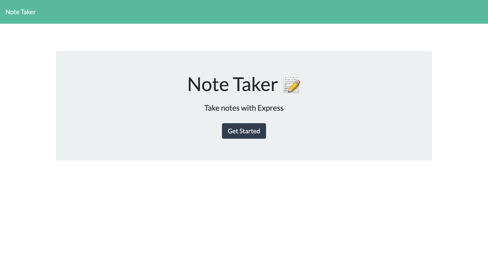
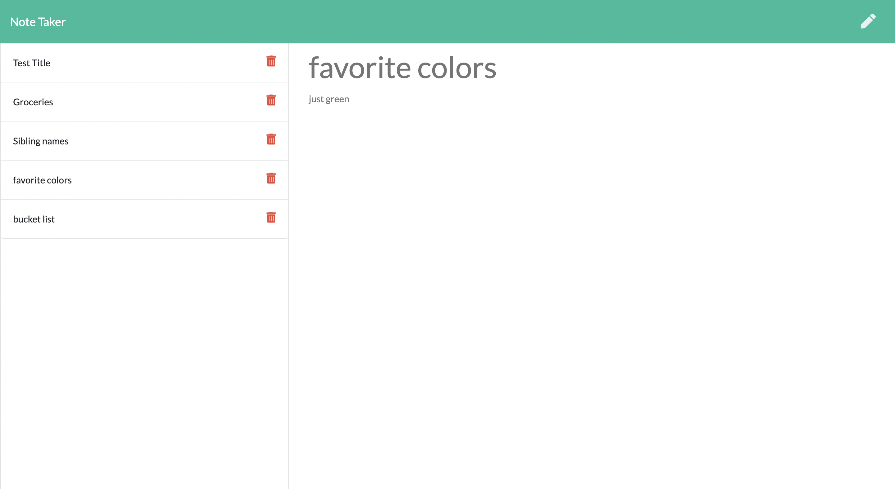

# Note Taker

## Table of Contents
[Project Link](#Link)  
[Technologies](#Technologies)  
[Description](#Description)  
[Screenshots](#Screenshots)  
[License](#License)  
[Contact](#Contact)

## Link
https://shrouded-headland-50998.herokuapp.com/

## Technologies
HTML, CSS, Javascript, Node.js, Express.js, Heroku

## Description
An app that allows the user to create, save and delete notes. The app uses a Heroku server to save user input, allowing the notes to persist upon refresh without the use of local storage.

## Screenshots
  

## License
MIT

## Contact
Dalton Wilkins - wilkins.271@osu.edu
